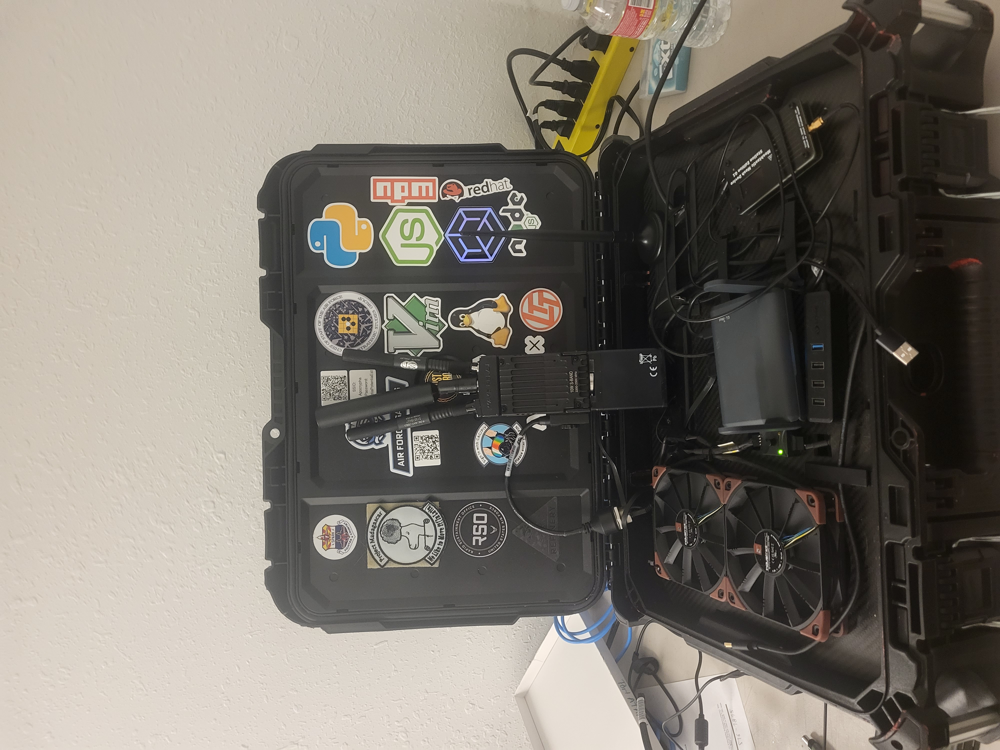
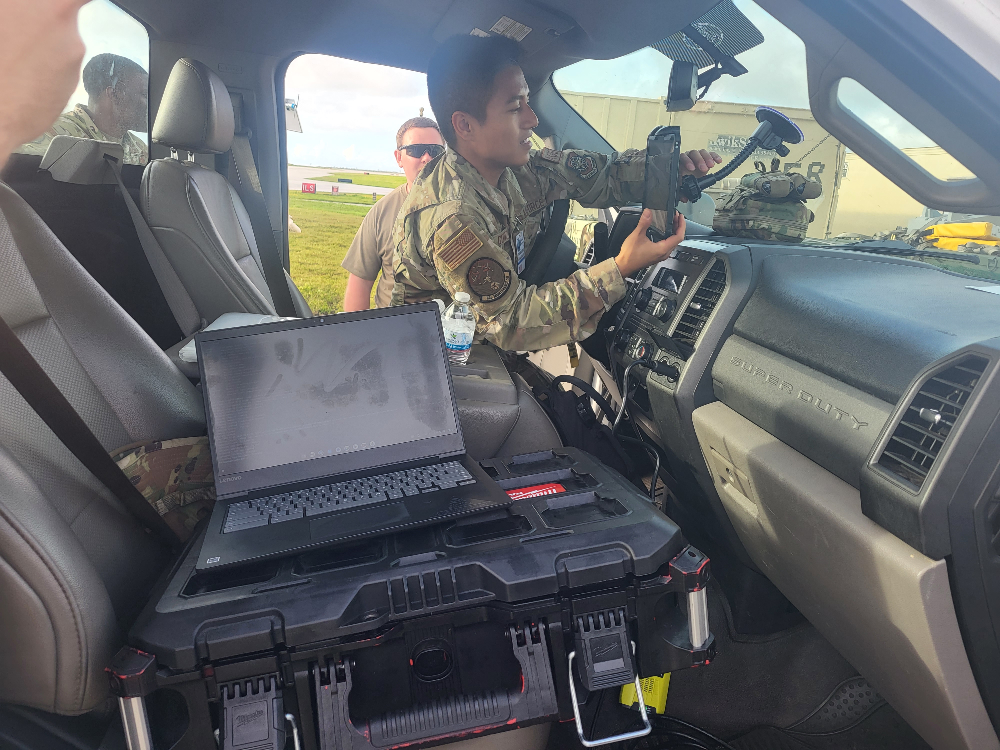
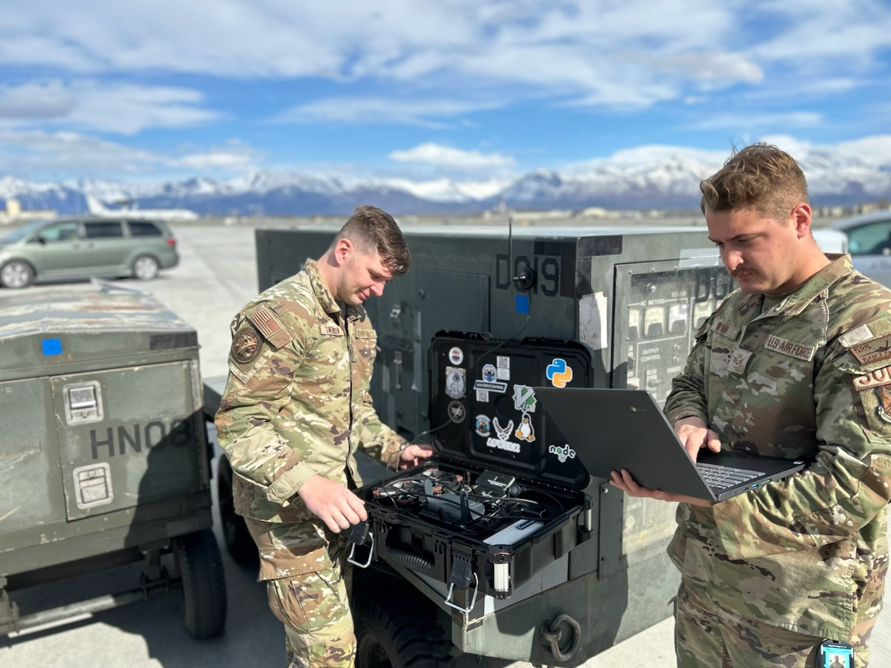

# SABR
The Scalable Airman Bootstrap Resource (SABR) is a system designed to make push-button comm systems easily deployable in disconnected locations. 

[Read the white paper.](./docs/SABR%20Paper.pdf)

## Components
### Hardware
- Compute
    - At least one source of compute, ranging from a single board computer (SBC) like the [Raspberry Pi](https://www.raspberrypi.com/) to a small form factor PC (SFFPC).
- Storage
    - Use-case specific, recommended 256 GB or greater.
- Networking
    - A router with a controllable DNS, such as [OpenWRT](https://openwrt.org/).
    - (Optional) A network switch, if multiple there are anough clients to need it.
- Power
    - Power strip plugged into 120v wall power, generator, car invertor, etc.
    - OR
    - Battery powered.
- Case
    - Something that can be carried by a single person, and is fairly weather resistant and shock resistant. 

### Software

*Note: Example configs [located here](./prototypes/v1).*

Specfic software deployments should be dependent on use case, but systems should utilize a container service like [Docker](https://www.docker.com/) for rapid deployment of new services.

#### Example Software
- Server Mangament
    - [Docker](https://www.docker.com/)
    - [NGINX](https://nginx.org/)
    - [NPM](https://nginxproxymanager.com/)
- Communication
    - [Mattermost](https://mattermost.com/)
    - [Meshtastic](https://meshtastic.org/)
    - [TAK](https://tak.gov/)
- Knowledge Management
    - [Wiki.js](https://js.wiki/)
    - [File Browser](https://filebrowser.org/features)
- Custom
    - [Inventory Management](https://github.com/bmswens/Inventory-Management)
    - [Meshtastic Web API](https://github.com/bmswens/Meshtastic-Web-API)

## Implementations

- [V1](./prototypes/v1)
    - First implementation.
- [Lite-SABR](./prototypes/lite-sabr)
    - Battery powered, extremely portable version housed in a [faraday cage](https://en.wikipedia.org/wiki/Faraday_cage) until deployment is neccessary.
- [V2](https://github.com/kmolter14/SABR-Config-Install)
    - Similar to V1, but battery powered. 

## Successes
- Presented at the 2023 [LOA Symposium](https://www.logisticsymposium.org/Home)
    - Demonstrated rapid deployment and ad-hoc service orchestration capabilities.
- Arctic Edge 2023
    - Proved the capability to do computer-based deployed kit managment with automatic update files for ILSS.
- Mobility Guardian 2023
    - Utilized ad-hoc container deployment to test [Jetdash by Technergetics](https://technergetics.com/mobile-logistics/).
    - Successfully integrated with an [MPU5](https://www.persistentsystems.com/mpu5/) radio system to broadcast a TAK server to Security Forces accross the flight line and enable access to perimiter cameras and other warning systems.

## Credits

- [Project Arc](https://usaf-project-arc.github.io/)
    - Providing the time and connections to implement and test. 
- [Brandon Swenson]()
    - Initial idea, paper, and implementation of the first protoype and lite SABR.
- [Jordon Jones]()
    - Case recommendation, CNC design for carbon fiber plate.
- [Kris Molter]()
    - Second iteration of the SABR, first battery powered prototype.

## Images

